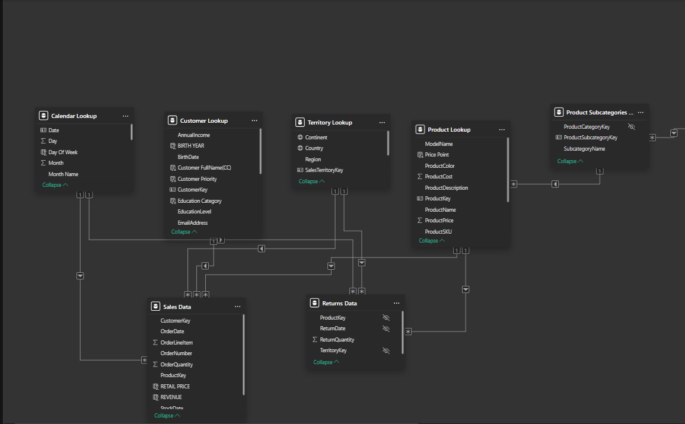
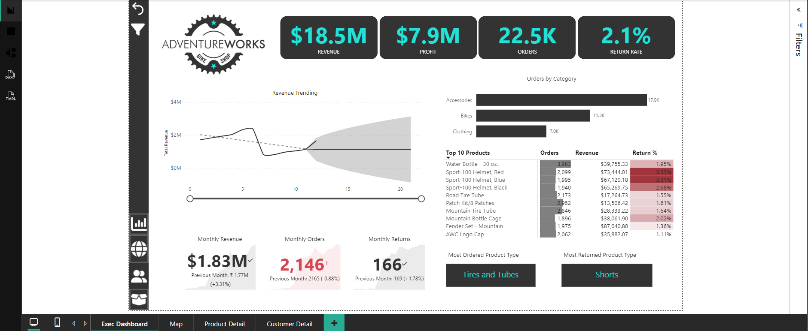
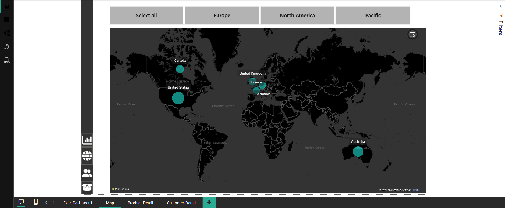
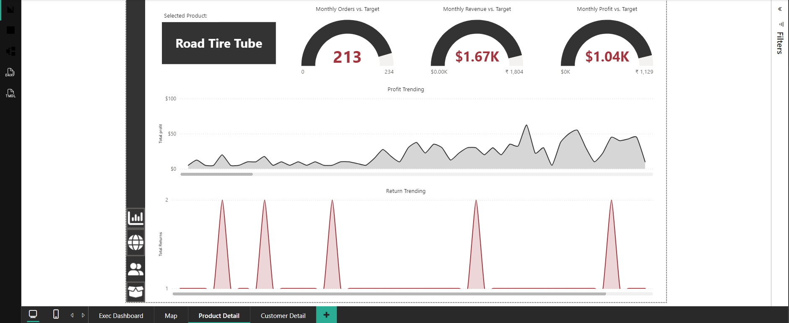
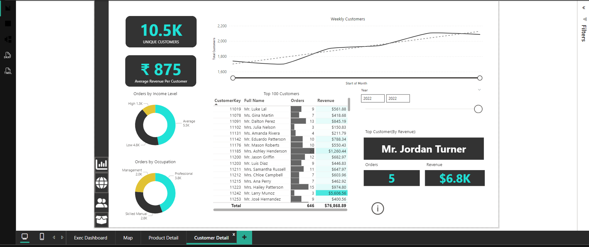

# Sales Performance Dashboard — AdventureWorks Bike Shop

AdventureWorks is a bike and accessories retailer selling across North America, Europe, and the Pacific region. This dashboard provides insight into revenue, profit, order volume, returns, customer segmentation, and product performance to support data-driven business decisions.

**Tools used:** Power BI Desktop, Power Query, DAX, Data Modeling (Star Schema)

---

## Data Model

The dataset is structured as a star schema for optimized analytical querying:

- **Fact Tables:** Sales Data, Returns Data
- **Dimension Tables:** Calendar Lookup, Customer Lookup, Territory Lookup, Product Lookup, Product Subcategories

This model supports time-intelligence calculations, customer segmentation, and product-level drill-down across every report page.

---

## ① Exec Dashboard

**Business Requirement**
Provide leadership with a single-page view of overall business health — revenue, profitability, order volume, and return rate — along with month-over-month movement.

**KPIs Displayed**
- Total Revenue: $18.5M
- Total Profit: $7.9M
- Total Orders: 22.5K
- Return Rate: 2.1%
- Monthly Revenue: $1.83M *(vs. previous month $1.77M, +3.31%)*
- Monthly Orders: 2,146 *(vs. previous month 2,165, -0.88%)*
- Monthly Returns: 166 *(vs. previous month 169, +1.78%)*

**Insights Provided**
- Revenue trending shows overall trajectory with forecasted range
- Orders by Category breakdown: Accessories (17.0K), Bikes (11.3K), Clothing (7.0K)
- Top 10 Products ranked by orders, revenue, and return percentage
- Most Ordered Product Type: Tires and Tubes
- Most Returned Product Type: Shorts

**Business Value**
- Enables quick executive-level decision-making
- Identifies which product types drive volume vs. which drive returns, informing inventory and quality decisions

---

## ② Map

**Business Requirement**
Visualize where revenue and customer demand are concentrated geographically to support regional strategy and resource allocation.

**Key Metrics**
- Sales distribution by country: United States, Canada, United Kingdom, France, Germany, Australia
- Regional filters: Europe, North America, Pacific

**Insights Provided**
- Relative sales concentration by market, shown via proportional map markers
- Quick regional filtering to isolate performance by continent

**Business Value**
- Supports market prioritization and regional resource allocation
- Helps identify underperforming or high-growth geographies at a glance

---

## ③ Product Detail

**Business Requirement**
Allow stakeholders to drill into any single product's performance against target, and track its profit and return behavior over time.

**Key Metrics** *(example shown: Road Tire Tube)*
- Monthly Orders vs. Target: 213 / 234
- Monthly Revenue vs. Target: $1.67K / $1.804K
- Monthly Profit vs. Target: $1.04K / $1,129

**Insights Provided**
- Profit trending over time for the selected product
- Return trending over time, highlighting recurring return spikes

**Business Value**
- Supports product-level performance reviews against targets
- Flags products with recurring return spikes for quality or listing review

---

## ④ Customer Detail

**Business Requirement**
Understand who AdventureWorks' customers are, segment them meaningfully, and identify top-value customers.

**Key Metrics**
- Unique Customers: 10.5K
- Average Revenue Per Customer: ₹875
- Orders by Income Level: High (1.3K), Average (5.5K), Low (4.8K)
- Orders by Occupation: Management (2.0K), Professional (3.8K), Skilled Manual (2.8K)
- Top Customer by Revenue: Mr. Jordan Turner — 5 orders, $6.8K revenue

**Insights Provided**
- Weekly customer trend over the selected date range
- Top 100 customers ranked by revenue with drill-through detail
- Customer segmentation by income level and occupation

**Business Value**
- Enables targeted marketing toward high-value customer segments
- Supports customer retention strategy by identifying top revenue contributors

---

## Project File

The full interactive `.pbix` file is available in this repository: [`Udemy_Power_BI_Project.pbix`](Udemy_Power_BI_Project.pbix)

---

## Skills Demonstrated

`Power BI` `Power Query` `DAX` `Star-Schema Data Modeling` `Time Intelligence` `Customer Segmentation` `Executive Reporting`
